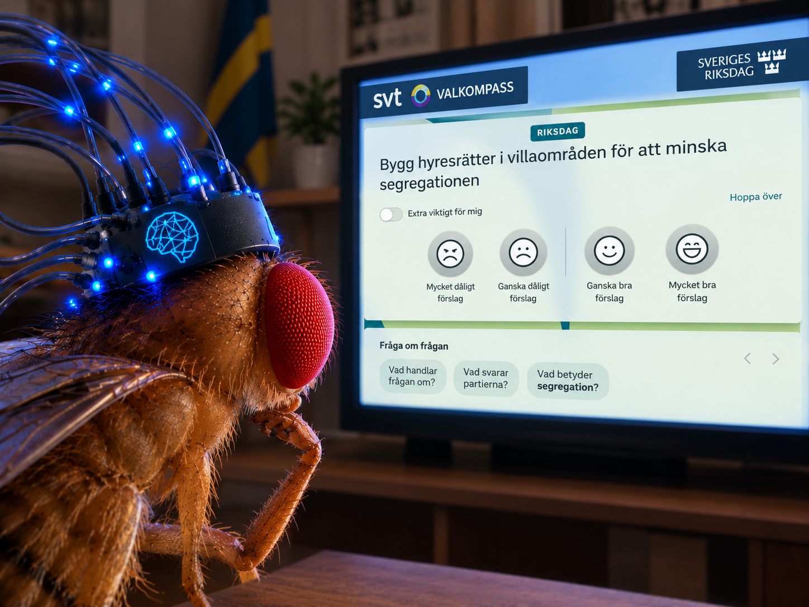
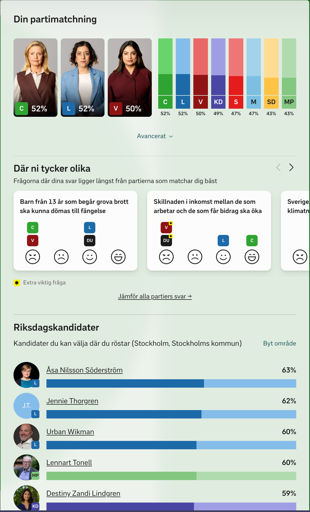

# Bananflugakompassen

A fruit fly brain answers the SVT Valkompass 2026.

The brain is the [MaleCNS v1.0](https://male-cns.janelia.org/) connectome: 166,700 neurons,
25.6 million connections, simulated as leaky integrate-and-fire cells at 0.1 ms. The
simulator, visual input mapping and dopamine circuit are copied unchanged from
[Stonkfly](https://github.com/nftechie/stonkfly), which uses the same fly to trade crypto.
This repo replaces the price chart with screenshots of election questions.

## How it works

1. Blank grey screen for 500 ms of neural time, then the question screenshot for
   500 ms, then blank again. The fly's 3,335 R1-R6 photoreceptors get luminance and
   811 R8 cells get blue/green, sampled at fixed points across the image. It cannot
   read. It sees layout and brightness. The blanks stop one question bleeding into
   the next.
2. Brain state is snapshotted.
3. From that snapshot the fly sees a blank for 500 ms. That gives the baseline.
4. From the same snapshot it sees each answer tile (four smileys, or five circles on
   a 1-5 question) for 500 ms. Score per tile = mean membrane voltage above rest of
   the approach MBONs minus that of the avoidance MBONs, minus the baseline. The sets
   follow [Aso et al. 2014](https://elifesciences.org/articles/04580): approach is
   MBON07, 09, 11, 12, 13, 14, avoidance is MBON01, 03, 04, 05, 06. Voltage rather
   than spikes because these 22 cells spike rarely in 500 ms and the voltage is what
   calcium imaging of MBON dendrites measures. These are the mushroom body output
   cells that dopamine rewires when a fly learns; here nothing teaches it, so this is
   innate preference.
5. Step 4 runs five times with small fixed pixel shifts and brightness changes on the
   tiles. The simulator is deterministic, real neurons are not; the jitter stands in
   for trial-to-trial noise. Highest mean score over the five runs wins. The `n/5`
   after the answer is how many runs agreed with it. An exact tie in the mean is
   "Hoppa över". Four or more agreeing flips the "Extra viktigt för mig" toggle.
6. Snapshot is restored and the fly sees the winning tile once more, so the choice
   carries into the next question.

No learning. Weights are frozen. No randomness. Same screenshots in the same order
give the same answers every run.

Before the first question the script prints the fly's innate bias: the same tile
scoring on a fresh brain that has seen no question. If the answers below match it,
the questions did nothing.

Earlier versions read MBON07 minus MBON11 spike counts. MBON11 is an approach cell
per Aso et al., so that was approach minus approach. Fixed.

## Run it

[uv](https://docs.astral.sh/uv/), a C++ compiler, ~16 GB RAM. `prepare.py` downloads
about 1 GB from Janelia and compiles the graph.

```sh
uv run prepare.py
uv run valkompass.py
```

Screenshots go in `screenshots/` as `NN-anything.png`, numeric order. A 1-5 scale
question is `NNs-anything.png`, the `s` picks `options/scale/` instead of
`options/smiley/`. Output is one line per question: filename, score per tile,
answer. Click the answers into SVT yourself.

## Results

[`results/result.png`](results/result.png) is what SVT says when you click the
answers from [`results/output_example.txt`](results/output_example.txt) in.



<details>
<summary>Full output</summary>

```
Probing the fly's innate tile bias on a blank screen, 5 jitter trials per tile...
  #  question                                        1      2      3      4      5  answer
     innate bias, no question, smiley           -13.91 -35.62 -18.73 -31.00       
     innate bias, no question, scale            -27.26 -29.73 -37.52 -26.01 -22.50
Bias probe done. Showing 35 questions from screenshots...
  1  barn-fran-13-ar-som-begar-grova-brott-sk    +0.43  +1.33  +1.72  -0.88         ganska bra (1/5)
  2  vinstdrivande-aktiebolag-ska-inte-fa-dri    +1.34  +1.70  +1.16  +0.50         ganska daligt (3/5)
  3  bygg-hyresratter-i-villaomraden-for-att-    -1.65  -1.20  -1.13  -0.28         mycket bra (3/5)
  4  skillnaden-i-inkomst-mellan-de-som-arbet    +1.44  +0.58  +0.27  +0.75         mycket daligt (4/5) extra viktigt
  5  det-ska-bli-enklare-att-starta-gruvor-oc    +1.10  +0.13  +0.24  +0.49         mycket daligt (3/5)
  6  sverige-ska-ha-mer-ambitiosa-klimatmal-n    -0.46  +0.65  -0.39  -0.19         ganska daligt (2/5)
  7  permanenta-uppehallstillstand-ska-rivas-    -0.52  +0.04  -0.21  +0.32         mycket bra (3/5)
  8  sverige-ska-pa-sikt-lamna-nato              +0.74  +1.16  +0.38  -0.31         ganska daligt (1/5)
  9  public-service-ska-ha-ett-smalare-uppdra    -0.74  -0.53  -1.76  -0.90         ganska daligt (2/5)
 10  karensavdraget-vid-sjukdom-ska-avskaffas    +0.39  +0.32  +0.47  -0.01         ganska bra (2/5)
 11  betyg-i-ordning-och-uppf-rande-ska-inf-r    -0.48  +0.52  -0.14  +0.19         ganska daligt (3/5)
 12  pensionsaldern-ska-inte-hojas               -0.40  -1.29  -0.64  -1.54         mycket daligt (1/5)
 13  tillat-forsaljning-av-stark-l-och-vin-i-    -0.43  -0.93  +0.47  +0.34         ganska bra (3/5)
 14  staten-ska-investera-mer-pengar-i-gr-na-    +1.11  +1.43  +1.46  +0.89         ganska bra (2/5)
 15  sverige-bor-infora-euro-som-valuta          -1.03  -0.88  -1.42  -0.85         mycket bra (1/5)
 16  sverige-ska-6ka-det-internationella-bist    +1.55  +1.16  +1.29  +1.22         mycket daligt (3/5)
 17  marknadshyror-ska-inf-ras-pa-nya-hyresra    -0.65  -0.05  -0.71  -0.87         ganska daligt (2/5)
 18  skolan-ska-ta-storre-ansvar-for-undervis    -0.07  -0.91  -0.66  -0.83         mycket daligt (2/5)
 19  det-ska-vara-majligt-att-dra-tillbaka-me    +1.40  +0.94  +2.04  +2.14         mycket bra (2/5)
 20  lagstifta-om-kortare-veckoarbetstid         -0.82  -0.97  -0.96  -1.66         mycket daligt (1/5)
 21  skatten-pa-bensin-och-diesel-ska-sankas     +2.47  +2.84  +1.28  +1.23         ganska daligt (3/5)
 22  sverige-ska-verka-for-att-fler-lander-er    +2.08  +1.63  +0.78  +1.63         mycket daligt (3/5)
 23  det-offentliga-stodet-till-kulturverksam    +0.45  +0.23  -0.27  -0.37         mycket daligt (2/5)
 24  tandvard-for-personer-under-23-ar-ska-va    +1.09  +1.15  +0.94  -0.50         ganska daligt (2/5)
 25  grova-sexuella-6vergrepp-mot-barn-ska-ku    -0.59  -0.61  -0.87  -0.54         mycket bra (1/5)
 26  den-tillfalligt-s-nkta-momsen-pa-mat-ska    -0.04  -0.99  -1.08  -0.15         mycket daligt (2/5)
 27  staten-ska-ge-ekonomiskt-stdd-till-bygga    -1.67  -0.81  -1.89  -0.85         ganska daligt (3/5)
 28  kommunerna-ska-inte-langre-kunna-stoppa-    +1.12  +0.34  +0.89  +1.01         mycket daligt (2/5)
 29  staten-ska-ta-6ver-ansvaret-for-sjukvard    -1.58  -1.42  -1.29  -1.72         ganska bra (0/5)
 30  staten-bor-ge-ekonomiskt-stod-for-att-by    +1.91  +1.64  +1.70  +2.22         mycket bra (4/5) extra viktigt
 31  pappamanaderna-i-foraldraf-rsakringen-sk    -1.22  -1.64  -0.94  -0.62         mycket bra (3/5)
 32  hur-nara-ekonomiskt-och-militart-samarbe    +1.27  +2.10  +2.76  +1.85  +2.73  3 (1/5)
 33  hur-mycket-ska-hoginkomsttagare-betala-i    -2.23  -1.69  -1.66  -1.10  -0.88  5 (0/5)
 34  hur-6ppet-ska-sverige-vara-for-att-ta-em    +0.33  -0.28  -0.41  -0.10  +0.63  5 (2/5)
 35  hur-mycket-av-skogen-i-sverige-ska-skydd    -2.38  -1.93  -2.70  -1.04  -1.90  4 (2/5)
```

</details>

## Credits

The simulator, connectome import, visual mapping and dopamine circuit were written by
[nftechie](https://github.com/nftechie) for [DOOMFLY](https://github.com/nftechie/doomfly)
and [Stonkfly](https://github.com/nftechie/stonkfly), MIT. This repo only points the fly
at a different screen. Connectome data from the MaleCNS collaboration, CC BY 4.0.
See `THIRD_PARTY.md`.
